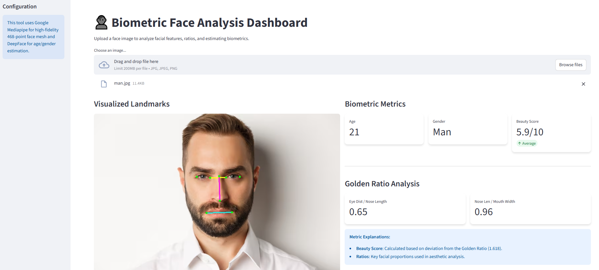
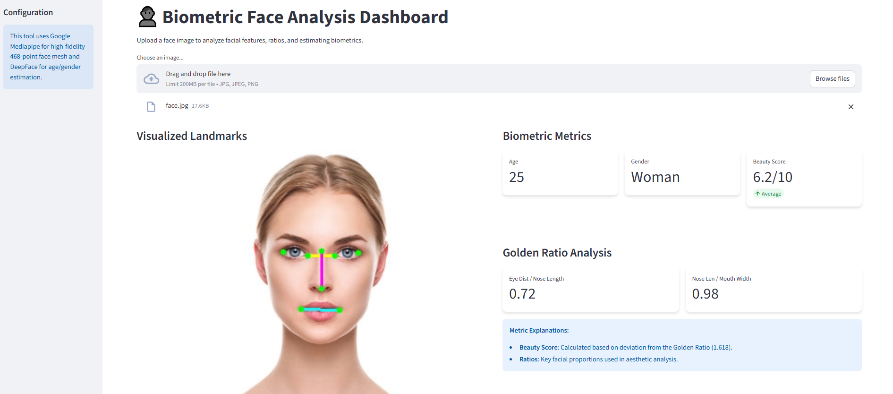

# 👤 Biometric Face Analysis Dashboard

A professional biometric analysis tool built with Python, Streamlit, and Google Mediapipe. This dashboard detects facial landmarks, calculates aesthetic ratios (Golden Ratio analysis), and estimates age/gender using deep learning.

## 📸 Example Results

Here are some real-time analysis results from the dashboard:

| Original Image | Biometric Analysis |
| :---: | :---: |
|  |  |
|  |  |

## 🚀 Features

-   **High-Fidelity Face Mesh:** Uses **Google Mediapipe** to detect 468 facial landmarks with high precision.
-   **Biometric Analysis:** Calculates key facial ratios (e.g., Eye Distance / Nose Length) and compares them to the Golden Ratio.
-   **AI Estimations:** Uses **DeepFace** (TensorFlow) for Age and Gender prediction.
-   **Interactive UI:** Modern, responsive dashboard built with **Streamlit**.
-   **Visual Feedback:** Real-time visualization of facial landmarks and measurement lines.

## 🛠️ Installation

1.  **Clone the repository:**
    ```bash
    git clone https://github.com/YourUsername/Biometric-Face-Analysis-Dashboard.git
    cd Biometric-Face-Analysis-Dashboard
    ```

2.  **Run the Setup Script (Windows):**
    Simply double-click **`run_dashboard.bat`**. 
    
    *This script will automatically:*
    *   Create a local virtual environment (`venv`).
    *   Install all required dependencies from `requirements.txt`.
    *   Set up local model directories to save disk space.
    *   Launch the application.

## 📦 Manual Installation (Optional)

If you prefer to install manually via terminal:

```bash
# Create virtual environment
python -m venv venv

# Activate it
.\venv\Scripts\activate

# Install dependencies
pip install -r requirements.txt

# Run the app
python -m streamlit run app.py
```

## 💻 Tech Stack

*   **Python 3.10+**
*   **Streamlit:** Web Interface
*   **Mediapipe:** Face Mesh & Landmarking
*   **DeepFace:** Age & Gender Analysis
*   **OpenCV & NumPy:** Image Processing

## 📝 Notes

*   **First Run:** The first time you run the app, it may take a few minutes to download the DeepFace models (approx 500MB). These are saved locally in the `deepface_home` folder.
*   **Privacy:** All processing is done locally on your machine. No images are uploaded to external servers.

## 📄 License

This project is licensed under the MIT License - see the [LICENSE](LICENSE) file for details.

---
*Developed by [Your Name]*
